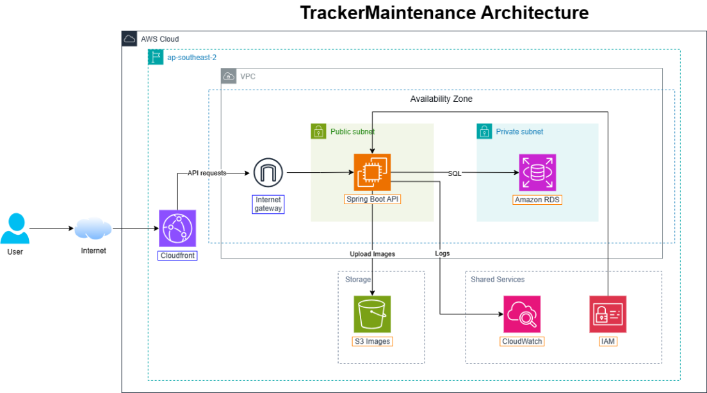

## Tracker Maintenance – Hệ thống quản lý bảo trì thiết bị trên nền tảng AWS
### Giải pháp vận hành an toàn với kiến trúc đám mây đa lớp và bảo mật phân tầng

### 1. Tóm tắt điều hành
Tracker Maintenance là hệ thống phần mềm quản lý các tác vụ bảo trì thiết bị, được xây dựng trên kiến trúc Multi-tier (Đa lớp) hiện đại vận hành trên Amazon Web Services (AWS). Giao diện người dùng (Frontend) được phát triển bằng React, trong khi hệ thống xử lý logic cốt lõi (Backend) sử dụng **Spring Boot (Java 21)**, kết hợp với cơ sở dữ liệu quan hệ bảo mật đặt trong hạ tầng mạng riêng ảo.

### 2. Mục tiêu
Mục tiêu cốt lõi của dự án Tracker Maintenance tập trung vào việc tối ưu hóa quy trình quản lý và nâng cao mức độ an toàn thông tin:
- Xây dựng hạ tầng đám mây ổn định, phân tách rõ ràng giữa phân vùng mạng công cộng và mạng nội bộ bảo mật.
- Triển khai máy chủ ứng dụng Spring Boot tích hợp các tiêu chuẩn bảo mật phân tầng và kiểm soát quyền hạn chặt chẽ.
- Tối ưu hóa hiệu suất xử lý tệp tin và hình ảnh bảo trì thông qua việc tích hợp lưu trữ đối tượng Amazon S3.
- Thiết lập hệ thống giám sát và thu thập nhật ký tập trung nhằm đảm bảo khả năng quan sát (Observability) toàn diện cho hệ thống.

### 3. Tuyên bố vấn đề
- **Tình trạng hiện tại:** Các hệ thống quản lý truyền thống thường gặp khó khăn trong việc phân quyền truy cập, dễ phát sinh rủi ro bảo mật ở tầng dữ liệu và thường xuyên gặp hiện tượng nghẽn cổ chai khi xử lý tải tệp tin dung lượng lớn qua máy chủ trung tâm.
- **Giải pháp:** Tracker Maintenance tận dụng mạng riêng ảo Amazon VPC để cô lập cơ sở dữ liệu. Ứng dụng Backend (Spring Boot) được triển khai an toàn trên Amazon EC2, kết hợp với dịch vụ lưu trữ đối tượng Amazon S3 và hệ thống giám sát Amazon CloudWatch.
- **Lợi ích:** Mang lại một hệ thống có tính sẵn sàng cao, bảo mật chặt chẽ từ lớp mạng đến lớp ứng dụng, đồng thời cung cấp giao diện quản lý và trải nghiệm mượt phà cho đội ngũ kỹ thuật.

### 4. Kiến trúc hệ thống
Toàn bộ hạ tầng được triển khai trên vùng `ap-southeast-2` (Sydney) của AWS với cấu trúc mạng phân tầng rõ rệt:

**Công nghệ sử dụng:**
- **Frontend:** React / Tailwind CSS.
- **Backend:** Spring Boot (Java 21).
- **Cơ sở dữ liệu:** Amazon RDS (PostgreSQL).

**Các dịch vụ AWS cốt lõi:**
- **Amazon VPC:** Thiết lập không gian mạng riêng tư, phân tách thành Public Subnet (chứa EC2) và Private Subnet (chứa RDS).
- **Amazon EC2:** Máy chủ ảo vận hành ứng dụng Spring Boot API và các logic nghiệp vụ.
- **Amazon RDS:** Cơ sở dữ liệu quan hệ lưu trữ thông tin hệ thống và dữ liệu bảo trì.
- **Amazon S3:** Kho lưu trữ đối tượng an toàn cho hình ảnh và tài liệu kỹ thuật của hệ thống.
- **Amazon CloudWatch:** Dịch vụ giám sát tập trung, thu thập nhật ký hoạt động (logs) từ máy chủ ứng dụng.
- **Route 53 & ACM / Private CA:** Quản lý phân giải tên miền và chứng chỉ số bảo mật kết nối.
- **Amazon Bedrock:** Tích hợp trí tuệ nhân tạo hỗ trợ phân tích dữ liệu bảo trì.

**Các luồng dữ liệu chính:**
- **Luồng xử lý nghiệp vụ:** Người dùng gửi yêu cầu thông qua giao diện, đi qua tầng mạng công cộng để vào máy chủ Spring Boot API trên EC2, sau đó truy vấn dữ liệu an toàn từ cơ sở dữ liệu RDS trong vùng mạng riêng.
- **Luồng quản lý tệp tin:** Máy chủ Spring Boot xử lý và tương tác trực tiếp với kho lưu trữ Amazon S3 thông qua cơ chế phân quyền bảo mật IAM Role.

### 5. Triển khai kỹ thuật
Nhóm phát triển phân chia các nhiệm vụ cụ thể để đảm bảo tiến độ dự án:
- **Phát triển ứng dụng (Frontend & Backend):** Xây dựng giao diện người dùng bằng React và phát triển các API nghiệp vụ bằng Spring Boot.
- **Xây dựng Hạ tầng AWS:** Thiết lập cấu trúc mạng VPC, cấu hình Security Groups khắt khe, triển khai RDS và máy chủ EC2.
- **Bảo mật và Giám sát:** Cấu hình phân quyền IAM theo Nguyên tắc Quyền hạn tối thiểu và tích hợp giám sát CloudWatch Logs.

### 6. Lộ trình triển khai
Lộ trình dự án được phân chia theo các giai đoạn cụ thể:
- **Giai đoạn 1:** Khởi tạo cấu trúc mã nguồn, thiết kế cơ sở dữ liệu và xây dựng giao diện cơ bản.
- **Giai đoạn 2:** Phát triển logic nghiệp vụ Backend với Spring Boot và kết nối cơ sở dữ liệu cục bộ.
- **Giai đoạn 3:** Thiết lập hạ tầng mạng trên AWS (VPC, Subnets, Security Groups) và triển khai cơ sở dữ liệu RDS.
- **Giai đoạn 4:** Triển khai ứng dụng lên Amazon EC2, cấu hình lưu trữ S3, hoàn thiện hệ thống giám sát CloudWatch và nghiệm thu toàn diện.

### 7. Đánh giá rủi ro
- **Rủi ro truy cập trái phép cơ sở dữ liệu:** Được triệt tiêu hoàn toàn nhờ thiết kế mạng VPC cô lập Amazon RDS trong Private Subnet, không mở cổng kết nối trực tiếp ra Internet.
- **Rủi ro lộ lọt thông tin xác thực:** Được kiểm soát chặt chẽ thông qua việc cấu hình biến môi trường an toàn và áp dụng nguyên tắc phân quyền IAM tối thiểu.

### 8. Kết quả kỳ vọng
Triển khai thành công hệ thống Tracker Maintenance hoạt động ổn định, bảo mật và tối ưu hóa hiệu năng trên nền tảng AWS. Dự án minh họa năng lực thiết kế kiến trúc hệ thống phân tầng và ứng dụng thực tế các dịch vụ điện toán mây hiện đại vào bài toán quản lý bảo trì.